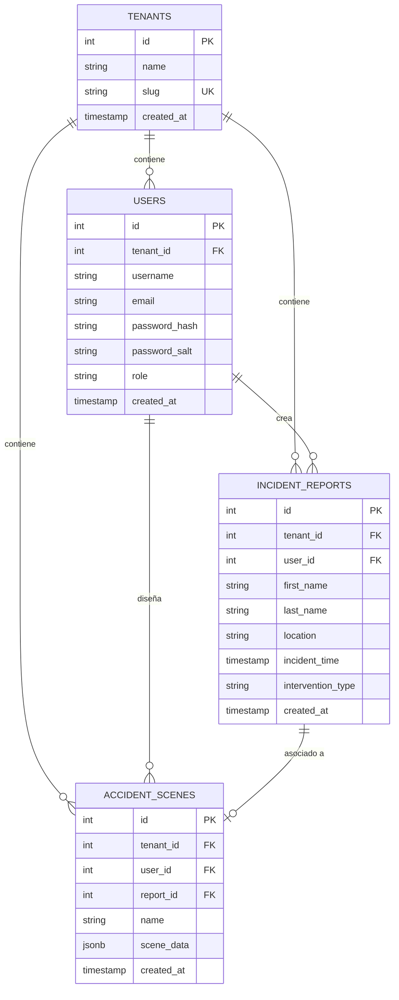

# Acciparte Reconstruct - Panel de Incidentes & Croquis 2D (Multi-Tenant)


Una plataforma web de nivel profesional para la reconstrucción gráfica de accidentes de tráfico y reporte de incidentes, diseñada específicamente para Acciparte. Esta aplicación demuestra una arquitectura **Multi-Tenant robusta con aislamiento de datos a nivel de fila (Row-Level Isolation)** en el backend y una herramienta interactiva de dibujo vectorial 2D en el frontend utilizando la biblioteca gráfica **Konva**.

---

## 🌟 Características Destacadas

### 🔒 1. Aislamiento Multi-Tenant (Nivel de Fila)
* **Aislamiento Lógico Riguroso**: Compartición del mismo esquema de base de datos entre diferentes inquilinos (*tenants*) garantizando separación completa por medio de claves foráneas e indexación optimizada.
* **Seguridad basada en JWT**: El token de sesión del usuario encapsula el contexto e identificador de su tenant (`tenant_id`), el cual es extraído en el servidor y utilizado obligatoriamente en todas las consultas de la base de datos.
* **Panel de Simulación Incorporado**: Widget flotante interactivo en el frontend para alternar instantáneamente entre diferentes inquilinos de prueba (ej: `policia-madrid` vs `bomberos-bcn`) y verificar visualmente que no existe fuga de información.

### 📝 2. Formulario de Incidentes en Dos Pasos (Wizard)
* **Paso 1: Datos de Identificación**: Nombre del reportante, apellidos y localización geográfica del siniestro.
* **Paso 2: Datos de Intervención**: Fecha y hora exacta junto con el tipo de intervención (Accidente vial, incendio, auxilio en vía pública, etc.).
* **Transiciones Fluidas**: Animaciones premium y validación en tiempo real en cada sección del formulario.

### 🎨 3. Diseñador Vial / Constructor Gráfico (Konva Canvas)
* **Dibujo Vectorial**: Permite posicionar elementos interactivos en el escenario del accidente:
  * **Vehículos**: Turismos, Camiones/Furgones, Coches Patrulla y Motocicletas.
  * **Obstáculos**: Conos reflectantes y Vallas/Barreras de contención.
  * **Señalización**: Semáforos y Pasos de peatones.
  * **Líneas Guía**: Línea discontinua y continua con colores personalizables.
  * **Anotaciones**: Notas de texto dinámicas sobre el croquis.
* **Manipulación Interactiva**: Soporte completo de arrastre (Drag & Drop), rotación precisa en 360 grados y escalado mediante manejadores visuales (*Transformers*).
* **Herramientas de Productividad**:
  * **Alineación a Rejilla (Snap to Grid)** para un dibujo geométrico ordenado.
  * **Zoom y Pan** libre sobre el escenario.
  * **Historial de cambios (Deshacer/Rehacer)** mediante pila de estados `Ctrl+Z` / `Ctrl+Y`.
* **Guardado y Exportación**:
  * Guardado persistente de escenas en la base de datos PostgreSQL en formato estructurado JSON.
  * Asociación directa de los croquis con los reportes de incidentes.
  * Exportación nativa a archivo `.json` de datos vectoriales.
  * Renders en imagen de alta resolución `.png`.

---

## 📂 Estructura del Proyecto

El proyecto está organizado como un monorepo claro y estructurado que separa limpiamente el Frontend (React + Vite) y el Backend (Node.js + Express):

### 💻 1. Frontend (Estructura Modular)
La arquitectura de componentes en el frontend está estrictamente segmentada por dominios de negocio y responsabilidades funcionales:

```
frontend/src/
├── assets/                 # Logotipos y recursos estáticos (Logo.svg, etc.)
├── context/                # Contexto de autenticación global (AuthContext.jsx)
├── services/               # Clientes API Axios (api.js)
├── components/             # Componentes React organizados por dominio
│   ├── auth/               # Gestión de acceso y registro (Login, Register)
│   ├── layout/             # Elementos comunes de la interfaz (Navbar, Footer)
│   ├── simulation/         # Panel interactivo de simulación multi-tenant (SimulationPanel)
│   ├── dashboard/          # Panel de control de incidentes y partes
│   │   ├── subcomponents/  # Componentes internos del dashboard:
│   │   │   ├── KpiStats.jsx           # Tarjetas con indicadores y cobertura
│   │   │   ├── IncidentList.jsx       # Tabla con filtro y buscador de reportes
│   │   │   ├── CroquisGrid.jsx        # Lista y buscador lateral de croquis
│   │   │   ├── ScenePreviewModal.jsx  # Modal de vista previa Konva interactiva
│   │   │   └── MapPicker.jsx          # Selector geográfico e integración Leaflet/OSM
│   │   ├── IncidentFormModal.jsx      # Formulario Wizard en dos pasos
│   │   └── Dashboard.jsx              # Vista principal y orquestador del Dashboard
│   └── editor/             # Herramientas de reconstrucción vectorial 2D
│       ├── subcomponents/  # Componentes de interacción y control del editor:
│       │   ├── ElementPalette.jsx     # Selector lateral con categorías de assets
│       │   ├── Toolbar.jsx            # Controles de zoom, rejilla, dibujo libre e historial
│       │   ├── PropertyInspector.jsx  # Ajustes finos de escala, rotación, color y texto
│       │   └── SaveExportPanel.jsx    # Lógica de guardado en la nube y descargas JSON/PNG
│       ├── CustomShape.jsx            # Traductor y renderizador de figuras vectoriales Konva
│       └── SceneEditor.jsx            # Editor y gestor de eventos del canvas de dibujo
```

### ⚙️ 2. Backend (Arquitectura en Capas)
El servidor sigue el patrón MVC clásico y cuenta con aislamiento forzado de base de datos de extremo a extremo:

```
backend/
├── schema.sql              # Definición de tablas y RLS de base de datos en PostgreSQL
├── src/
│   ├── index.js            # Punto de entrada principal y configuración del servidor Express
│   ├── config/             # Configuración y pool de conexiones a la base de datos (db.js)
│   ├── middlewares/        # Middlewares de Express (validación JWT, control de CORS)
│   ├── routes/             # Definición de endpoints de API (auth, reports, scenes)
│   ├── controllers/        # Lógica de negocio (controladores HTTP de control tenant)
│   └── models/             # Abstracciones o interacciones directas de persistencia
```

---

## 📐 Modelo de Base de Datos (Relacional)

El esquema relacional implementado en PostgreSQL consta de cuatro tablas principales estructuradas en el archivo `backend/schema.sql`:



---

## 🛠️ Requisitos e Instalación

### Prerrequisitos
* **Node.js** (versión 18 o superior)
* **PostgreSQL** (versión 14 o superior)

### Configuración del Entorno local

1. **Clonar el Repositorio e Inicializar Base de Datos**:
   Crea una base de datos en PostgreSQL con el nombre `incident_db` e importa las tablas:
   ```bash
   createdb incident_db
   psql -d incident_db -f backend/schema.sql
   ```

2. **Backend**:
   Entra en la carpeta `backend`, instala las dependencias y arranca el servidor en modo desarrollo:
   ```bash
   cd backend
   npm install
   npm run dev
   ```
   *Nota: El archivo `.env` permite configurar individualmente las credenciales y parámetros de conexión de la base de datos utilizando `DB_USER`, `DB_PASSWORD`, `DB_HOST`, `DB_PORT` y `DB_NAME`.

3. **Frontend**:
   Abre otra terminal, entra en la carpeta `frontend`, instala dependencias e inicia Vite:
   ```bash
   cd frontend
   npm install
   npm run dev
   ```
   *Abre en tu navegador la URL dev que te indique Vite (por defecto `http://localhost:5173`).*

---

## 🔒 Detalles Técnicos del Aislamiento

El aislamiento multi-tenant se garantiza de extremo a extremo sin relying en peticiones vulnerables:
1. **JWT Firmado**: El payload del token generado tras el login incluye `{ id, tenantId, role }`. La firma con la clave secreta previene manipulaciones.
2. **Middleware `protect`**: En `/backend/src/middlewares/auth.js`, interceptamos el header `Authorization`, decodificamos el JWT y asociamos el usuario autenticado a `req.user`.
3. **Filtro Forzado**: Las rutas críticas `/api/reports` y `/api/scenes` realizan consultas a la base de datos inyectando `req.user.tenantId` como argumento de filtrado. No existe ninguna query que no contenga la condición `WHERE tenant_id = $1`.

---

## 🎨 Representación de Datos de la Escena

La escena dibujada en el canvas se serializa en el campo `scene_data` (JSONB) con la siguiente estructura de elementos:

```json
[
  {
    "id": "el_1716168923456",
    "type": "vehicle_car",
    "name": "coche turismo 1",
    "x": 240,
    "y": 180,
    "rotation": 45,
    "scaleX": 1.2,
    "scaleY": 1.2,
    "color": "#ef4444"
  }
]
```

---

## 🚀 Hoja de Ruta: Próximos Pasos para Producción

En un entorno comercial real, para garantizar seguridad extrema y evitar que cualquier persona ajena intente unirse ilícitamente a una organización protegida (como la Policía de Madrid), se deberían implementar las siguientes medidas detalladas a continuación:

### 🛡️ 1. Seguridad Anti-Secuestro de Tenant (Tenant Hijacking)
* **Bloqueo de Auto-Unión Pública (Ya Mitigado)**: Hemos modificado el backend en esta entrega para rechazar solicitudes de registro públicas sobre identificadores de inquilinos existentes. Si el slug ya existe en el sistema, el servidor deniega la operación.
* **Flujos de Invitación Cerrados (Tokens JWT)**: Los nuevos oficiales o usuarios no deberían registrarse de forma autónoma. En su lugar, el Administrador del Tenant genera una invitación que envía por correo un token JWT de un solo uso con el `tenant_id` cifrado.
* **Lista Blanca de Dominios de Correo**: Configuración a nivel de base de datos de los dominios corporativos autorizados para cada Tenant (ej: solo correos con terminación `@policiademadrid.es` pueden ser aceptados dentro del espacio `policia-madrid`).

### 📦 2. Estrategias de Escalabilidad del Almacenamiento
* **Políticas RLS Nativas de PostgreSQL (Row-Level Security)**: En lugar de filtrar a nivel lógico en los controladores de Node.js (con cláusulas `WHERE`), se pueden configurar directivas nativas del motor PostgreSQL mediante:
  ```sql
  ALTER TABLE incident_reports ENABLE ROW LEVEL SECURITY;
  CREATE POLICY tenant_isolation_policy ON incident_reports 
  USING (tenant_id = current_setting('app.current_tenant_id'));
  ```
  Esto añade una capa de blindaje redundante directo en el motor de base de datos.
* **Base de Datos por Cliente (Database-per-Tenant)**: Para clientes gubernamentales o corporativos de alto perfil que exigen soberanía física de sus datos, el backend puede configurar un orquestador de pools de conexiones dinámicos que enrute las peticiones a servidores de bases de datos independientes.

---

Desarrollado con para el proceso de evaluación de **Acciparte**.
